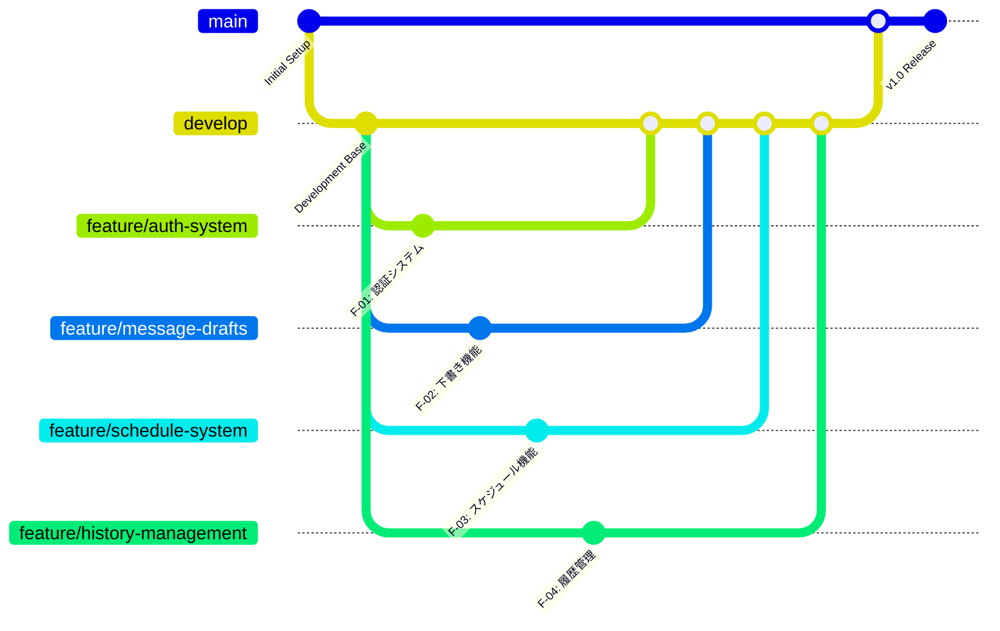

# やんわり伝言サービス - 機能ブランチ戦略

## 概要

3人チームでの並行開発を効率的に進めるための機能単位ブランチ戦略です。GitFlow + feature/*パターンを採用し、各機能を独立して開発できる体制を構築します。

## 現在の状況

- **現在のブランチ**: `main`
- **プロジェクト状況**: 基本的な環境構築完了（Go + Vue.js）
- **チーム構成**: 3名（FE Lead, BE Lead, DevOps）
- **開発方針**: GitFlow + feature/*ブランチ戦略

## ブランチ戦略図



## 機能ブランチ一覧

### 1. feature/auth-system (F-01: 認証機能)
- **担当**: BE Lead
- **優先度**: ★★★ (最優先)
- **実装内容**:
  - メール・パスワード認証
  - JWT発行・検証機能
  - ユーザー登録・ログイン API
  - Argon2パスワードハッシュ化
  - リフレッシュトークン機能
- **API エンドポイント**:
  - `POST /api/v1/auth/register`
  - `POST /api/v1/auth/login`
  - `POST /api/v1/auth/refresh`
  - `POST /api/v1/auth/logout`

### 2. feature/message-drafts (F-02: 下書き・トーン変換)
- **担当**: BE Lead + FE Lead (協力)
- **優先度**: ★★★ (最優先)
- **実装内容**:
  - 下書き作成・編集・削除 API
  - Anthropic API連携
  - トーン変換機能 (gentle/constructive/casual)
  - フロントエンド下書きUI
  - リアルタイムプレビュー
- **API エンドポイント**:
  - `POST /api/v1/drafts`
  - `GET /api/v1/drafts/:id`
  - `PUT /api/v1/drafts/:id`
  - `DELETE /api/v1/drafts/:id`
  - `POST /api/v1/drafts/:id/transform`

### 3. feature/schedule-system (F-03: 送信スケジュール)
- **担当**: BE Lead
- **優先度**: ★★★ (最優先)
- **実装内容**:
  - スケジュール設定API
  - 時間指定送信機能
  - タイムゾーン対応 (UTC+TZ変換)
  - 送信キュー管理
  - 送信状態管理
- **API エンドポイント**:
  - `POST /api/v1/schedules`
  - `GET /api/v1/schedules`
  - `PUT /api/v1/schedules/:id`
  - `DELETE /api/v1/schedules/:id`

### 4. feature/history-management (F-04: 履歴管理)
- **担当**: FE Lead + BE Lead (協力)
- **優先度**: ★★☆
- **実装内容**:
  - 送信履歴一覧API
  - 検索・フィルタリング機能
  - ページネーション
  - フロントエンド履歴UI
  - エクスポート機能
- **API エンドポイント**:
  - `GET /api/v1/history`
  - `GET /api/v1/history/search`
  - `GET /api/v1/history/:id`

### 5. feature/frontend-ui (UI/UX基盤)
- **担当**: FE Lead
- **優先度**: ★★★
- **実装内容**:
  - 基本レイアウトコンポーネント
  - ルーティング設定 (Vue Router)
  - 状態管理設定 (Pinia)
  - 共通UIコンポーネント
  - レスポンシブデザイン
- **主要コンポーネント**:
  - `AppLayout.vue`
  - `NavigationBar.vue`
  - `DraftEditor.vue`
  - `ScheduleForm.vue`
  - `HistoryList.vue`

### 6. feature/infrastructure (インフラ・CI/CD)
- **担当**: DevOps
- **優先度**: ★★☆
- **実装内容**:
  - Docker設定 (開発・本番環境)
  - GitHub Actions CI/CD
  - 環境変数管理
  - AWS ECS デプロイメント設定
  - 監視・ログ設定
- **成果物**:
  - `Dockerfile` (backend/frontend)
  - `docker-compose.yml`
  - `.github/workflows/`
  - `terraform/` (IaC)

## 開発フロー

### 1. ブランチ作成手順
```bash
# developブランチを作成
git checkout -b develop

# 機能ブランチを作成
git checkout develop
git checkout -b feature/auth-system

# 開発作業...

# developにマージ
git checkout develop
git merge feature/auth-system
```

### 2. プルリクエストフロー
1. 機能ブランチで開発完了
2. `develop`ブランチに対してPR作成
3. コードレビュー実施
4. CI/CDテスト通過確認
5. `develop`にマージ
6. 統合テスト実施
7. `main`にマージしてリリース

## ブランチ命名規則

| ブランチタイプ | 命名パターン | 例 |
|---------------|-------------|-----|
| 機能開発 | `feature/機能名` | `feature/auth-system` |
| バグ修正 | `bugfix/修正内容` | `bugfix/login-validation` |
| ホットフィックス | `hotfix/修正内容` | `hotfix/security-patch` |
| リリース準備 | `release/バージョン` | `release/v1.0.0` |

## 並行開発の調整ポイント

### 1. API設計の事前合意
- OpenAPI仕様書の作成・共有
- レスポンス形式の統一
- エラーハンドリングの統一

### 2. データベーススキーマの共有
- MongoDB コレクション設計
- インデックス設計
- データ移行スクリプト

### 3. 環境変数の管理
- `.env.example`の更新
- 各機能で必要な設定の文書化
- 本番環境設定の準備

### 4. 共通コンポーネントの調整
- UIコンポーネントライブラリの選定
- 共通ユーティリティ関数
- 型定義の共有 (TypeScript)

## マイルストーン

### Sprint 1 (Week 1-2)
- [ ] `develop`ブランチ作成
- [ ] `feature/auth-system`開発完了
- [ ] `feature/frontend-ui`基盤完了

### Sprint 2 (Week 3-4)
- [ ] `feature/message-drafts`開発完了
- [ ] `feature/schedule-system`開発完了

### Sprint 3 (Week 5-6)
- [ ] `feature/history-management`開発完了
- [ ] `feature/infrastructure`設定完了
- [ ] 統合テスト実施

### Sprint 4 (Week 7-8)
- [ ] βテスト実施
- [ ] 本番リリース準備
- [ ] v1.0.0 リリース

## 注意事項

1. **コンフリクト回避**: 同じファイルを複数人で編集する場合は事前調整
2. **定期的な同期**: `develop`ブランチの変更を定期的に各機能ブランチに取り込み
3. **テストの徹底**: 各機能ブランチでユニットテスト・統合テストを実施
4. **ドキュメント更新**: API変更時は必ずドキュメントも更新

## 関連ドキュメント

- [README.md](./README.md) - プロジェクト要件定義
- [SETUP.md](./SETUP.md) - 開発環境セットアップ
- [API仕様書](./docs/api-spec.md) - API設計書 (作成予定)

---

**作成日**: 2025年6月15日  
**最終更新**: 2025年6月15日  
**作成者**: Architect Mode